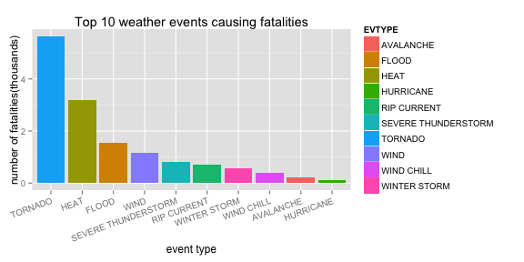
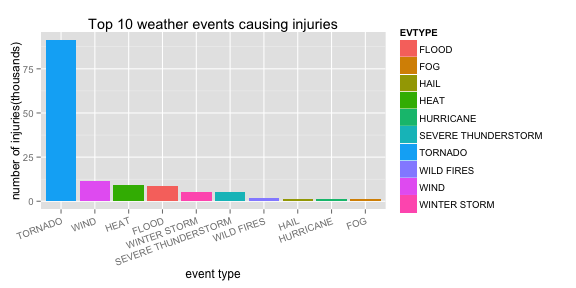
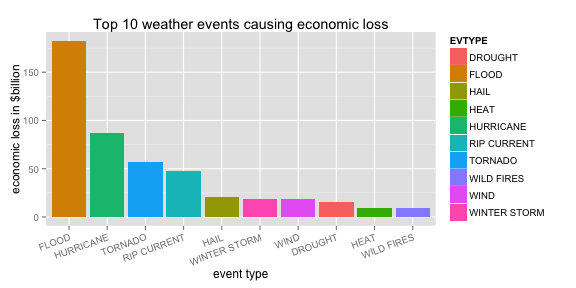

Severe weather events with respect to population health and economic consequeces
========================================================
## Synopsis:
 1. Objective: explore the NOAA Storm Database to find out the most severe types of events(EVTYPE variable) with respect to population health and economic consequences.
 2. Population health include two related variables: "FATALITIES(fatalities number)", "INJURIES(injuries number)". Here I made statistics analysis seperately on these two variables.
 3. Economic consequeces include four related variables: "PROPDMG(property damage number)", "PROPDMGEXP(exponent for property damage)", "CROPDMG(crop damage number)", "CROPDMGEXP(exponent for crop damage)". I make statictic analysis based on the sum of property and crop damages costs.
 4. I rank the top 10 weather event types for each index. From the plots showed on this report, we can see top10 has include the most severe weather event types.
 5. Conclusion: Across the United States, Tornado is the most severe event type with respect to population health; Flood is the most severe event type with respect to economic consequences. 

 
## Cleaning data stratergies.
### 1. Merging ENTYPE similar names:
EVTYPE variable includes many names which are similar with each other. We need to clean up them and merge the similar ones. But since there are hundreds of different event types names, it is a time costly work we clean one by one. 
- sort ENTYPE in normal ways based on the fatalities number regardless of the ENTYPE, and then merge the similar ENTYPE names only for top20 fatalities causing event types. 
- And then sort ENTYPE in normal ways based on the injuries number regardless of the ENTYPE, and then merge the similar ENTYPE names only for top20 injuries causing event types. 
- At last sort ENTYPE in normal ways based on the economic loss regardless of the ENTYPE, and then merge the similar ENTYPE names only for top20 economic loss causing event types.
- In this way, we merged three times. Cleaning up the top20 rows each time makes sure that no similar event types exist in top 10(will rank top 10 severe weather events) when we rank the ENTYPE based on whichever consequence.

### 2.Processing "CROPDMGEXP" & "PROPDMGEXP" 
we will process "CROPDMGEXP" & "PROPDMGEXP" variables to numbers to calculate the economic damage loss of property and crop damage("CROPDMG" & "PROPDMG"). 
'EXP' is regarded as exponent.Treated the exponent values in form of characters as follows:
- '?', '+' and '-'  exp value = 'NA'
- 'h/H' means hundred, exp value = 2
- 'k/K' means 'thousand', exp value = 3
- 'm/M' means 'million' , exp value = 6
- 'b/B',means billion, exp value of 9
compute economic damage loss in dollars as following
x("CROPDMGEXP"/"PROPDMGEXP" ) * 10^exp value("CROPDMGEXP" / "PROPDMGEXP" )

## Data Processing
 
### 1.load and read the data

```r
library(downloader)
download("https://d396qusza40orc.cloudfront.net/repdata%2Fdata%2FStormData.csv.bz2", destfile = "StormData.csv.bz2")
storm <- read.csv("Stormdata.csv.bz2", stringsAsFactors = FALSE, header = TRUE)
```

### 2.Select useful data

```r
#select only the data related with "population health" and "economic consequences", store them to the new dataframe
storm1 <- storm[ , c("EVTYPE", "FATALITIES", "INJURIES", "PROPDMG", "PROPDMGEXP", "CROPDMG", "CROPDMGEXP")]
```

### 3.Processing similar event types and  PRPGDMGEXP & CROPDMGEXP variables.
please see **Cleaning up data stratergies** section part1 for instructions.
#### 3.1 sort and select top20 EVTYPE based on fatalities number.

```r
#calculate sum of fatalities number for each EVTYPE, store the values in  dataframe *storm_fatal* .
library(plyr)
storm_fatal <- ddply(storm1,.(EVTYPE), summarize, sum_fatal = sum(FATALITIES))
#sort *storm_fatal* in decreasing order based on sum_fatal value and store in a new dataframe *fatal_order*.
fatal_order <- storm_fatal[order(storm_fatal$sum_fatal, decreasing = TRUE),]
#look up top 20 fatal_order data 
h1 <- head(fatal_order, 20)
h1[order(h1$EVTYPE),]
```

```
##                      EVTYPE sum_fatal
## 19                AVALANCHE       224
## 30                 BLIZZARD       101
## 130          EXCESSIVE HEAT      1903
## 140            EXTREME COLD       160
## 141 EXTREME COLD/WIND CHILL       125
## 153             FLASH FLOOD       978
## 170                   FLOOD       470
## 275                    HEAT       937
## 278               HEAT WAVE       172
## 310              HEAVY SNOW       127
## 350               HIGH SURF       101
## 359               HIGH WIND       248
## 464               LIGHTNING       816
## 585             RIP CURRENT       368
## 586            RIP CURRENTS       204
## 676             STRONG WIND       103
## 760       THUNDERSTORM WIND       133
## 834                 TORNADO      5633
## 856               TSTM WIND       504
## 972            WINTER STORM       206
```

#### 3.2 clean up EVTYPE names after observing top20 rows of *fatal_order*
make similar EVTYPE names be the same(only considering top20 EVTYPE for fatalities).
EVTYPE names are changed based on the following rules
- "FLASH FLOOD|HEAVY RAIN" - "FLOOD", 
- ".*HEAT"-"HEAT"
- "HEAT WAVE"-"HEAT"
- "EXTREME COLD"-"WIND CHILL"
- "BLIZZARD|HEAVY SNOW|ICE STORM" - "WINTER STORM"
- "RIP CURRENTS|HIGH SURF" - "RIP CURRENT"
- ".*WIND"- "WIND"
- "WINDS"-"WIND"

```r
storm1$EVTYPE <- gsub("FLASH FLOOD|HEAVY RAIN", "FLOOD", storm1$EVTYPE)
storm1$EVTYPE <- gsub(".*HEAT","HEAT", storm1$EVTYPE)
storm1$EVTYPE <- gsub("HEAT WAVE","HEAT", storm1$EVTYPE)
storm1$EVTYPE <- gsub("EXTREME COLD","WIND CHILL", storm1$EVTYPE)
storm1$EVTYPE <- gsub("BLIZZARD|HEAVY SNOW|ICE STORM","WINTER STORM", storm1$EVTYPE)
storm1$EVTYPE <- gsub("RIP CURRENTS|HIGH SURF","RIP CURRENT",storm1$EVTYPE)
storm1$EVTYPE <- gsub("WINDS","WIND",storm1$EVTYPE)
storm1$EVTYPE <- gsub("(.*)WIND","WIND", storm1$EVTYPE)
```

#### 3.3 sort and select top20 EVTYPE based on injurises number.

```r
#calculate sum of injuries number for each EVTYPE, store the values in  dataframe *storm_injur* .
storm_injur <- ddply(storm1,.(EVTYPE), summarize, sum_injur = sum(INJURIES))
#sort *storm_injur* in decreasing order based on sum_injur value and store in a new dataframe *injur_order*.
injur_order <- storm_injur[order(storm_injur$sum_injur, decreasing = TRUE),]
#look up top 20 injur_order data 
h2 <- head(injur_order, 20)
h2[order(h2$EVTYPE),]
```

```
##                EVTYPE sum_injur
## 16          AVALANCHE       170
## 70          DENSE FOG       342
## 94         DUST STORM       440
## 121             FLOOD      8817
## 155               FOG       734
## 189             GLAZE       216
## 202              HAIL      1361
## 231              HEAT      9139
## 281 HURRICANE/TYPHOON      1275
## 330         LIGHTNING      5230
## 432       RIP CURRENT       681
## 601           TORNADO     91346
## 614    TROPICAL STORM       340
## 698        WILD FIRES       150
## 699  WILD/FOREST FIRE       545
## 701          WILDFIRE       911
## 704              WIND     11310
## 756        WIND CHILL       267
## 813      WINTER STORM      5122
## 836    WINTER WEATHER       398
```

#### 3.4 clean up EVTYPE names again after observing top20 rows of *injur_order*
make similar EVTYPE names be the same(only considering top20 EVTYPE for injuries).
EVTYPE names are changed based on the following rules:
- "DENSE FOG"-"FOG"
- "WILD/FOREST FIRE|WILDFIRE"-"WILD FIRES"
- "WINTER WEATHER"-"WINTER STORM" 
- "TROPICAL STORM"-"HEAT"

```r
storm1$EVTYPE <- gsub("DENSE FOG", "FOG",storm1$EVTYPE)
storm1$EVTYPE <- gsub("WILD/FOREST FIRE|WILDFIRE", "WILD FIRES",storm1$EVTYPE)
storm1$EVTYPE <- gsub("WINTER WEATHER", "WINTER STORM",storm1$EVTYPE)
storm1$EVTYPE <- gsub("TROPICAL STORM","HEAT",storm1$EVTYPE)
```

#### 3.5.processing "CROPDMGEXP" & "PROPDMGEXP" variables to numbers.
please see **Cleaning up data stratergies** section part2 for instructions.

```r
#process CROPDMGEXP variable
storm1$CROPDMGEXP <- gsub("\\?", "NA", storm1$CROPDMGEXP)
storm1$CROPDMGEXP <- gsub("k|K", "3", storm1$CROPDMGEXP)
storm1$CROPDMGEXP <- gsub("m|M", "6", storm1$CROPDMGEXP)
storm1$CROPDMGEXP <- gsub("b|B", "9", storm1$CROPDMGEXP)
#process PROPDMGEXP variable
storm1$PROPDMGEXP <- gsub("\\?|\\+|\\-", "NA", storm1$PROPDMGEXP)
storm1$PROPDMGEXP <- gsub("h|H", "2", storm1$PROPDMGEXP)
storm1$PROPDMGEXP <- gsub("k|K", "3", storm1$PROPDMGEXP)
storm1$PROPDMGEXP <- gsub("m|M", "6", storm1$PROPDMGEXP)
storm1$PROPDMGEXP <- gsub("b|B", "9", storm1$PROPDMGEXP)
#change CROPDMGEXP & PROPDMGEXP values to numeric vectors
storm1$CROPDMGEXP <- as.numeric(storm1$CROPDMGEXP)
```

```
## Warning: NAs introduced by coercion
```

```r
storm1$PROPDMGEXP <- as.numeric(storm1$PROPDMGEXP)
```

```
## Warning: NAs introduced by coercion
```

#### 3.6 add CORPDMG & PROPDMG up to sort and select top20 EVTYPE based on economic loss

```r
#calculate CROPDMG & PROPDMG loss for each event seperately(compute values as x * 10^exp value) and store the value on a new dataframe **ecoloss**.
ecoloss <- data.frame(prop_loss = storm1$PROPDMG*(10^storm1$PROPDMGEXP), crop_loss = storm1$CROPDMG*(10^storm1$CROPDMGEXP))
#calculate total loss of ROPDMG and PROPDMG (rowSums) for each event and add this column "total_loss" to *ecoloss*
ecoloss$total_loss <- rowSums(ecoloss, na.rm = TRUE)
#add EVTYPE column to ecoloss
ecoloss$EVTYPE <- storm1$EVTYPE

#calculate total loss for each EVTYPE, store the values in a new dataframe *storm_ecoloss*
storm_ecoloss <- ddply(ecoloss,.(EVTYPE), summarize, sum_eco = sum(total_loss))
#sort the EVTYPE in decreasing order based on sum_eco value and store the ordered data in a new dataframe *ecoloss_order* 
ecoloss_order <- storm_ecoloss[order(storm_ecoloss$sum_eco, decreasing = TRUE),]
#look up top 20 ecoloss_order data 
h3 <- head(ecoloss_order, 20)
h3[order(h3$EVTYPE),]
```

```
##                   EVTYPE   sum_eco
## 74               DROUGHT 1.502e+10
## 120                FLOOD 1.700e+11
## 143 FLOOD/SEVERE WEATHER 2.500e+09
## 178         FROST/FREEZE 1.104e+09
## 201                 HAIL 1.876e+10
## 230                 HEAT 9.307e+09
## 276            HURRICANE 1.461e+10
## 282       HURRICANE OPAL 3.192e+09
## 284    HURRICANE/TYPHOON 7.191e+10
## 333            LIGHTNING 9.425e+08
## 441          RIVER FLOOD 1.015e+10
## 455  SEVERE THUNDERSTORM 1.206e+09
## 514          STORM SURGE 4.332e+10
## 515     STORM SURGE/TIDE 4.642e+09
## 604              TORNADO 5.736e+10
## 696           WILD FIRES 8.793e+09
## 699                 WIND 1.823e+10
## 751           WIND CHILL 1.372e+09
## 779           WIND, HAIL 1.602e+09
## 808         WINTER STORM 1.756e+10
```

#### 3.7 clean up EVTYPE names once again after observing top20 rows of *ecoloss_order*
make similar EVTYPE names be the same(only considering top20 EVTYPE for economic loss).
EVTYPE names are changed based on the following rules: 
- "FLOOD/SEVERE WEATHER|RIVER FLOOD"- "FLOOD",
- "FROST/FREEZE"-"WINTER STORM"
- "HURRICANE/TYPHOON|HURRICAN OPAL" - "HURRICANE"
- "STORM SURGE|STORM SURGE/TIDE" - "RIP CURRENT"
- "WIND, HAIL" - "HAIL"
- "LIGHTNING" - "SEVERE THUNDERSTORM"

```r
storm1$EVTYPE <- gsub("FLOOD/SEVERE WEATHER|RIVER FLOOD","FLOOD",storm1$EVTYPE)
storm1$EVTYPE <- gsub("FROST/FREEZE", "WINTER STORM",storm1$EVTYPE)
storm1$EVTYPE <- gsub("HURRICANE/TYPHOON|HURRICAN OPAL", "HURRICANE", storm1$EVTYPE)
storm1$EVTYPE <- gsub("STORM SURGE|STORM SURGE/TIDE", "RIP CURRENT",storm1$EVTYPE)
storm1$EVTYPE <- gsub("WIND, HAIL","HAIL",storm1$EVTYPE)
storm1$EVTYPE <- gsub("LIGHTNING", "SEVERE THUNDERSTORM", storm1$EVTYPE)
```

### 4. Get the top 10 event types after merging similar EVTYPE.
#### 4.1.top 10 event types with respect to fatalities number

```r
#repeat step 3.1 
#calculate sum of fatalities number for each EVTYPE, 
#sort EVTYPE in decreasing order based on sum_fatal value.
storm_fatal_revised <- ddply(storm1,.(EVTYPE), summarize, sum_fatal = sum(FATALITIES))
fatal_order_revised <- storm_fatal_revised[order(storm_fatal_revised$sum_fatal, decreasing = TRUE),]

#selet only top 10 rows and change the unit of fatalities number to "thousand".
fatal_top <- fatal_order_revised[1:10,]
fatal_top$sum_fatal <- fatal_top$sum_fatal/1000
fatal_top
```

```
##                  EVTYPE sum_fatal
## 595             TORNADO     5.633
## 227                HEAT     3.187
## 120               FLOOD     1.548
## 690                WIND     1.165
## 440 SEVERE THUNDERSTORM     0.816
## 422         RIP CURRENT     0.697
## 798        WINTER STORM     0.556
## 742          WIND CHILL     0.380
## 16            AVALANCHE     0.224
## 273           HURRICANE     0.125
```

#### 4.2 get top 10 event types with respect to injuries number 

```r
#repeat step 3.3
#calculate sum of injuries number for each EVTYPE, 
#sort EVTYPE in decreasing order based on sum_injur value.
storm_injur_revised <- ddply(storm1,.(EVTYPE), summarize, sum_injur = sum(INJURIES))
injur_order_revised <- storm_injur_revised[order(storm_injur_revised$sum_injur, decreasing = TRUE),]

##selet only top 10 rows and change the unit of injurises number to "thousand".
injur_top <- injur_order_revised[1:10,]
injur_top$sum_injur <- injur_top$sum_injur/1000
injur_top
```

```
##                  EVTYPE sum_injur
## 595             TORNADO    91.346
## 690                WIND    11.310
## 227                HEAT     9.479
## 120               FLOOD     8.819
## 798        WINTER STORM     5.520
## 440 SEVERE THUNDERSTORM     5.230
## 687          WILD FIRES     1.606
## 198                HAIL     1.361
## 273           HURRICANE     1.321
## 152                 FOG     1.076
```

#### 4.3 get top 10 event types with respect to economic loss 

```r
#repeat step 3.6
#calculate CROPDMG & PROPDMG loss for each event seperately(compute values as x * 10^exp value) and store the value on a new dataframe *ecoloss_revised*.
ecoloss_revised <- data.frame(prop_loss = storm1$PROPDMG*(10^storm1$PROPDMGEXP), crop_loss = storm1$CROPDMG*(10^storm1$CROPDMGEXP))

#add ROPDMG and PROPDMG(rowSums) together for each event and add this column to *ecoloss_revised*
#add EVTYPE column to ecoloss_revised
ecoloss_revised$total_loss <- rowSums(ecoloss_revised, na.rm = TRUE)
ecoloss_revised$EVTYPE <- storm1$EVTYPE

#calculate total economic loss for each EVTYPE and sort in decreasing order.
storm_ecoloss_revised <- ddply(ecoloss_revised,.(EVTYPE), summarize, sum_eco = sum(total_loss))
ecoloss_order_revised <- storm_ecoloss_revised[order(storm_ecoloss_revised$sum_eco, decreasing = TRUE),]

#select only top 10 rows, and change the unit of ecoloss to $billion. store value in dataframe *top_ecoloss*
ecoloss_top <- ecoloss_order_revised[1:10,]
ecoloss_top$sum_eco <- ecoloss_top$sum_eco/10^9
ecoloss_top
```

```
##           EVTYPE sum_eco
## 120        FLOOD 182.640
## 273    HURRICANE  86.524
## 595      TORNADO  57.362
## 422  RIP CURRENT  48.055
## 198         HAIL  20.364
## 798 WINTER STORM  18.661
## 690         WIND  18.230
## 74       DROUGHT  15.019
## 227         HEAT   9.307
## 687   WILD FIRES   8.793
```

## RESULTS
### 1.plot event types in relation with population health.
make plots(fatal_top, injur_top) to show the Top 10 most harmful event types (as indicated in the EVTYPE variable) with respect to population health across the United States

```r
library(ggplot2)
g <- ggplot(fatal_top, aes(EVTYPE, sum_fatal))
plot_fatal <- g + geom_histogram(stat = "identity")+aes(fill = EVTYPE, reorder(EVTYPE, -sum_fatal))+ labs(x = "event type", y = "number of fatalities(thousands)", title = "Top 10 weather events causing fatalities") + theme(axis.text.x = element_text(angle=20, hjust=1))
print(plot_fatal)
```

 

```r
g <- ggplot(injur_top, aes(EVTYPE, sum_injur))
plot_injur <- g + geom_histogram(stat = "identity")+aes(fill = EVTYPE, reorder(EVTYPE, -sum_injur))+ labs(x = "event type", y = "number of injuries(thousands)", title = "Top 10 weather events causing injuries") + theme(axis.text.x = element_text(angle=20, hjust=1))
print(plot_injur)
```

 
### 2.plot severe event types in relation to economic consequences
make plots(ecoloss_top) to show the Top 10 most harmful event types (as indicated in the EVTYPE variable) with respect to economic loss across the United States

```r
g <- ggplot(ecoloss_top, aes(EVTYPE, sum_eco))
plot_ecoloss <- g + geom_histogram(stat = "identity")+aes(fill = EVTYPE, reorder(EVTYPE, -sum_eco))+ labs(x = "event type", y = "economic loss in $billion", title = "Top 10 weather events causing economic loss") + theme(axis.text.x = element_text(angle=20, hjust=1))
print(plot_ecoloss)
```

 

### 3. Summary
- Across the United States, Top4 most severe weather event types with respect to population health are: Tornado, Heat, Flood, and Wind. Among all of the weather event types, Tornado is the most severe one, and it has much more impact on population health with respect to both Fatalities and Injuries. 
- Across the United States, Top4 types of events with respect to the economic consequences are: Flood, HURRICANE, TORNADO, RIP CURRENT. Among all of the weather event types, Flood is the most severe one, and it has much more impact on economic consequences than the other ones.
 
## Thought for further discussion: 
- I merge the similar EVTYPE names only for the top20 in each ranking because of the time limit. Change the similar names using regular expression for all of them can make the analysis more precisely. 
- I didn't incluse state and date variables in my processed dataframe. Including them will make us to explore more questions, for instance, to understand the economic loss trend for each state, to explore which state account for the most of the flood or tornado?
